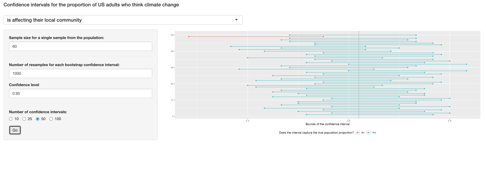
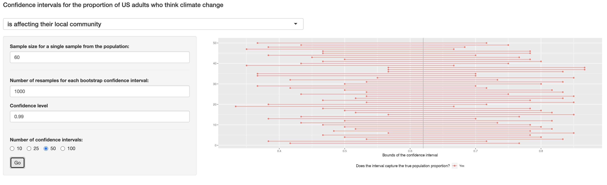
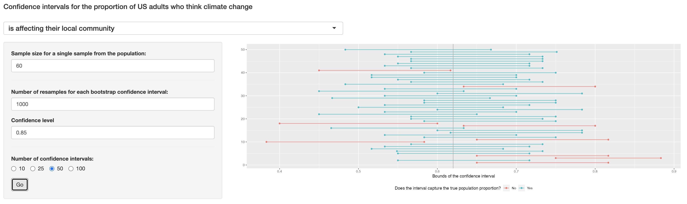

```{r global_options, include=FALSE}
knitr::opts_chunk$set(eval = TRUE, message = FALSE, warning = FALSE)
set.seed(12345)
library(tidyverse)
library(openintro)
library(infer)
```

### Exercise 1

#### What percent of the adults in your sample think climate change affects their local community?

```{r}
us_adults <- tibble(
  climate_change_affects = c(rep("Yes", 62000), rep("No", 38000))
)
```

```{r bar-plot-pop, fig.height=2.5, fig.width=10}
ggplot(us_adults, aes(x = climate_change_affects)) +
  geom_bar() +
  labs(
    x = "", y = "",
    title = "Do you think climate change is affecting your local community?"
  ) +
  coord_flip() 
```

```{r summ-stat-pop, results = TRUE}
us_adults %>%
  count(climate_change_affects) %>%
  mutate(p = n /sum(n))
```

```{r sample}
n <- 60
samp <- us_adults %>%
  sample_n(size = n)

samp %>%
  count(climate_change_affects) %>%
  mutate(p = n /sum(n))
```

In my sample, 34/60 (56%) of adults think climage change affects their local community.

### Exercise 2

#### Would you expect another student's sample proportion to be identical to yours? Would you expect it to be similar? Why or why not?


If we had the same seed, then yes it'd be identical. Otherwise, our proportions would likely not be identical, however it would be similar. This is due to randomness; our samples should be somewhat representative of the population, so we would both be close to 38%, however they would likely not be exactly the same.

### Exercise 3

#### In the interpretation above, we used the phrase "95% confident". What does "95% confidence" mean?


"95% confidence" means that we are 95% certain that the true proportion we are looking for is in between those bounds. It could inversely mean that we have a 5% chance of being incorrect with our boundaries.

### Exercise 4

#### Does your confidence interval capture the true population proportion of US adults who think climate change affects their local community?

```{r confidence interval infer}
samp %>%
  specify(response = climate_change_affects, success = "Yes") %>%
  generate(reps = 1000, type = "bootstrap") %>%
  calculate(stat = "prop") %>%
  get_ci(level = 0.95)
```

My confidence interval of 0.433 to 0.7 does capture the true population proportion of US adults who think climate change affects their local community as the actual number is 62%.


### Exercise 5

#### Each student should have gotten a slightly different confidence interval. What proportion of those intervals would you expect to capture the true population mean? Why? 


95%. This is because this is a 95% confidence interval -- therefore, we are 95% sure that our confidence interval has the true population mean. Extrapolating that to the entire class, that means that 95% of us have a correct range of values and 5% do not.

```{r shiny, echo=FALSE, eval=FALSE, results = TRUE}
# This R chunk will only run in interactive mode
store_ci <- function(i, n, reps, conf_level, success) {
  us_adults %>%
    sample_n(size = n) %>%
    specify(response = climate_change_affects, success = success) %>%
    generate(reps, type = "bootstrap") %>%
    calculate(stat = "prop") %>%
    get_ci(level = conf_level) %>%
    rename(
      x_lower = names(.)[1],
      x_upper = names(.)[2]
    )
}
library(shiny)
shinyApp(
  ui <- fluidPage(
    h4("Confidence intervals for the proportion of US adults who think 
     climate change"),

    h4(selectInput("success", "",
      choices = c(
        "is affecting their local community" = "Yes",
        "is not affecting their local community" = "No"
      ),
      selected = "Yes", width = "50%"
    )),

    # Sidebar with a slider input for number of bins
    sidebarLayout(
      sidebarPanel(
        numericInput("n_samp",
          "Sample size for a single sample from the population:",
          min = 1,
          max = 1000,
          value = 60
        ),

        hr(),

        numericInput("n_rep",
          "Number of resamples for each bootstrap confidence interval:",
          min = 1,
          max = 15000,
          value = 1000
        ),

        numericInput("conf_level",
          "Confidence level",
          min = 0.01,
          max = 0.99,
          value = 0.95,
          step = 0.05
        ),

        hr(),

        radioButtons("n_ci",
          "Number of confidence intervals:",
          choices = c(10, 25, 50, 100),
          selected = 50, inline = TRUE
        ),

        actionButton("go", "Go")
      ),

      # Show a plot of the generated distribution
      mainPanel(
        plotOutput("ci_plot")
      )
    )
  ),

  server <- function(input, output) {

    # set true p
    p <- reactive(ifelse(input$success == "Yes", 0.62, 0.38))

    # create df_ci when go button is pushed
    df_ci <- eventReactive(input$go, {
      map_dfr(1:input$n_ci, store_ci,
        n = input$n_samp,
        reps = input$n_rep, conf_level = input$conf_level,
        success = input$success
      ) %>%
        mutate(
          y_lower = 1:input$n_ci,
          y_upper = 1:input$n_ci,
          capture_p = ifelse(x_lower < p() & x_upper > p(), "Yes", "No")
        )
    })

    # plot df_ci
    output$ci_plot <- renderPlot({
      ggplot(df_ci()) +
        geom_segment(aes(x = x_lower, y = y_lower, xend = x_upper, yend = y_upper, color = capture_p)) +
        geom_point(aes(x = x_lower, y = y_lower, color = capture_p)) +
        geom_point(aes(x = x_upper, y = y_upper, color = capture_p)) +
        geom_vline(xintercept = p(), color = "darkgray") +
        labs(
          y = "", x = "Bounds of the confidence interval",
          color = "Does the interval capture the true population proportion?"
        ) +
        theme(legend.position = "bottom")
    })
  },
  options = list(height = 700)
)
```


### Exercise 6

#### Given a sample size of 60, 1000 bootstrap samples for each interval, and 50 confidence intervals constructed (the default values for the above app), what proportion of your confidence intervals include the true population proportion? Is this proportion exactly equal to the confidence level? If not, explain why. Make sure to include your plot in your answer.




It looks like 49/50 of my confidence intervals constructed include the true population proportion. Since we're 95% confident, it's not exact -- I'm at 98%. This is likely due to just the randomness of our samples and I managed to get a little luckier where my samples actually matched.

### Exercise 7

#### Choose a different confidence level than 95%. Would you expect a confidence interval at this level to me wider or narrower than the confidence interval you calculated at the 95% confidence level? Explain your reasoning.


I choose 90%. I would expect a confidence interval to be narrower than 95% because in this scenario, I would only be 90% confident. The bounds would then be more restrictive since this time, 10% of my intervals wouldn't fit the true proportion rate.

### Exercise 8

#### Using code from the **infer** package and data from the one sample you have (`samp`), find a confidence interval for the proportion of US Adults who think climate change is affecting their local community with a confidence level of your choosing (other than 95%) and interpret it.

```{r confidence interval infer ex8}
samp %>%
  specify(response = climate_change_affects, success = "Yes") %>%
  generate(reps = 1000, type = "bootstrap") %>%
  calculate(stat = "prop") %>%
  get_ci(level = 0.99)
```

Here, I chose a 99% confidence level and the bounds are 0.417 to 0.733. This is wider than the 95% confidence interval example and it makes sense as this is a higher level of confidence so it'd be a bit wider. This means we are 99% confident (or sure) that the population proportion is within these bounds and we are correct since 0.62 is between those two numbers.

### Exercise 9

#### Using the app, calculate 50 confidence intervals at the confidence level you chose in the previous question, and plot all intervals on one plot, and calculate the proportion of intervals that include the true population proportion. How does this percentage compare to the confidence level selected for the intervals?


    

Here, all of my confidence intervals have the true population proportion. This is 100% and the confidence interval is 99% -- I just got a bit lucky that it didn't end up at 98% (1 not having it), but this is very likely due to the randomness of sampling.


### Exercise 10

#### Lastly, try one more (different) confidence level. First, state how you expect the width of this interval to compare to previous ones you calculated. Then, calculate the bounds of the interval using the **infer** package and data from `samp` and interpret it. Finally, use the app to generate many intervals and calculate the proportion of intervals that are capture the true population proportion.


I'm choosing a confidence interval of 85 -- I expect this to be much narrower than the other two confidence levels due to it being much lower. 

```{r confidence interval infer ex10}
samp %>%
  specify(response = climate_change_affects, success = "Yes") %>%
  generate(reps = 1000, type = "bootstrap") %>%
  calculate(stat = "prop") %>%
  get_ci(level = 0.85)
```

The interval is from 0.467 to 0.667 -- much smaller than the other ranges of numbers. Now what does the app show?



This time, 9 of the 50 confidence intervals don't contain the true population proportion -- this means 82% of them did. Compared to 85%, that's pretty close!

### Exercise 11

#### Using the app, experiment with different sample sizes and comment on how the widths of intervals change as sample size changes (increases and decreases).


The larger the sample size gets, the narrower the interval grows.
    
### Exercise 12

#### Finally, given a sample size (say, 60), how does the width of the interval change as you increase the number of bootstrap samples. **Hint:** Does changing the number of bootstap samples affect the standard error?


The width of the interval grows narrower as we increase the bootstrap samples because the standard error seems to grow smaller when we increase the number of bootstrap samples.