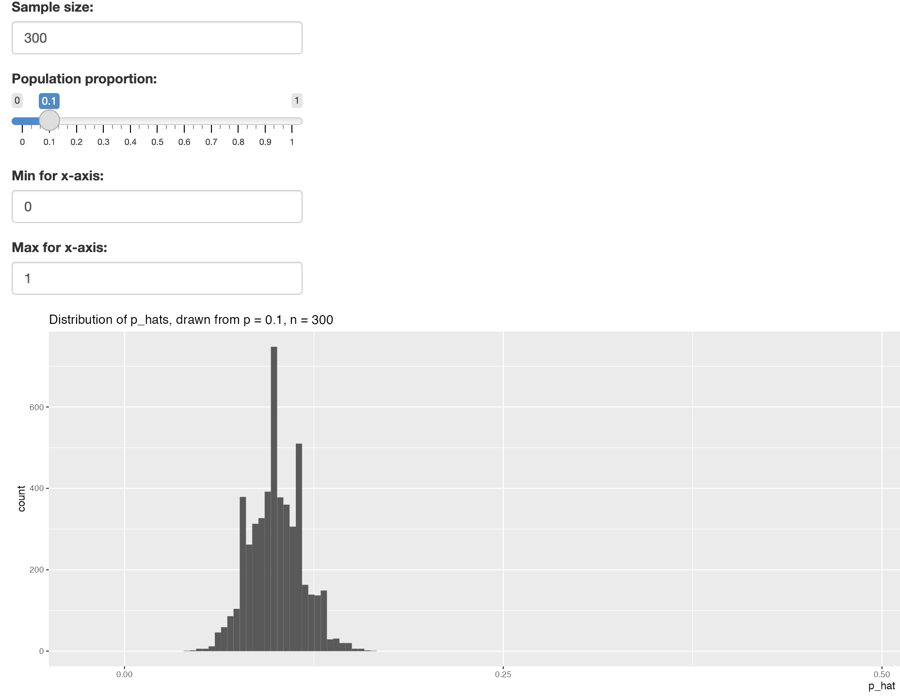
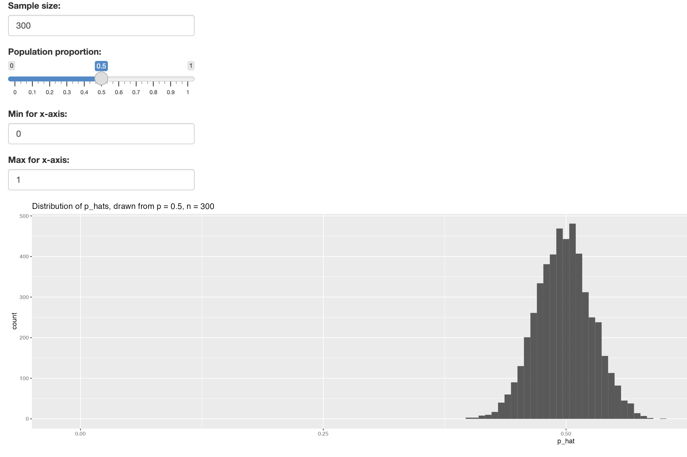
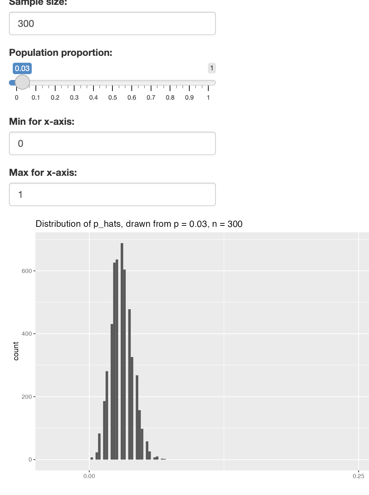
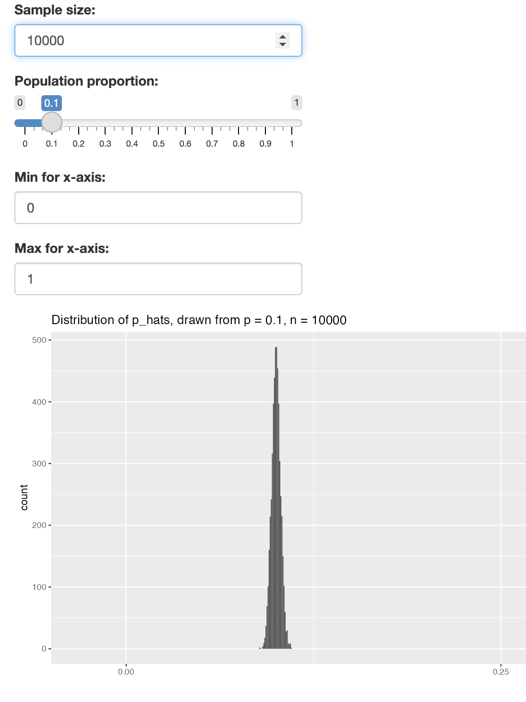
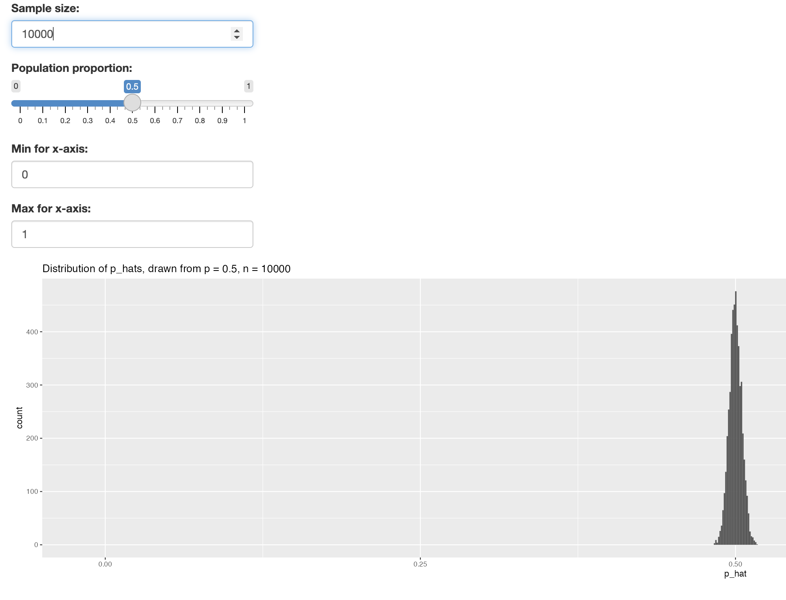

```{r global_options, include=FALSE}
knitr::opts_chunk$set(eval = TRUE, message = FALSE, warning = FALSE)
```

```{r load-packages}
set.seed(1234)
library(tidyverse)
library(openintro)
library(infer)
```

### Exercise 1

#### What are the counts within each category for the amount of days these students have texted while driving within the past 30 days?

```{r ex1}
data('yrbss', package='openintro')

text_while_driving <- yrbss |> 
  group_by(text_while_driving_30d) |>
  summarise(count = n(),
            percent = 100 * n()/nrow(yrbss),
            .groups = 'drop')

text_while_driving
```

We can see here that tha largest groups of students are in `did not drive` and `0` at about \~34-35% each (a little over 4.6k in both buckets). The rest of the \~23% (-7% as `NA` means they're likely unable to drive or just didn't answer the question) has texted while driving at some point within the past 30 days, a majority at either extreme (1-2 days vs. all 30).

### Exercise 2

#### What is the proportion of people who have texted while driving every day in the past 30 days and never wear helmets?

```{r no helmet}
no_helmet <- yrbss %>%
  filter(helmet_12m == "never")
```

```{r indicator-texting}
no_helmet <- no_helmet %>%
  mutate(text_ind = replace_na(ifelse(text_while_driving_30d == "30", "yes", "no"), "unknown"))

helmet_never_text <- no_helmet |> 
  group_by(text_ind) |>
  summarise(count = n(),
            percent = 100 * n()/nrow(no_helmet),
            .groups = 'drop')

helmet_never_text
```

We can see that a majority of students who never wear a helmet don't text while driving everyday at \~87% of the group.

### Exercise 3

#### What is the margin of error for the estimate of the proportion of non-helmet wearers that have texted while driving each day for the past 30 days based on this survey?

```{r nohelmet-text-ci}
no_helmet %>% filter(text_ind != "unknown") |>
  specify(response = text_ind, success = "yes") %>%
  generate(reps = 1000, type = "bootstrap") %>%
  calculate(stat = "prop") %>%
  get_ci(level = 0.95)
```

```{r ex3-margin-of-error}
ex3_lower_ci <- 0.0652
ex3_upper_ci <- 0.0777

ex3_me <- (ex3_upper_ci - ex3_lower_ci)/2
ex3_me
```

The margin of error is 0.00625.

### Exercise 4

#### Using the `infer` package, calculate confidence intervals for two other categorical variables (you'll need to decide which level to call "success", and report the associated margins of error. Interpet the interval in context of the data. It may be helpful to create new data sets for each of the two countries first, and then use these data sets to construct the confidence intervals.

The other two categorical variables I'll be looking at are `physically_active_7d` and `strength_training_7d`.

```{r ex4_active}
physically_active <- yrbss %>%
  mutate(active = replace_na(ifelse(physically_active_7d == 7, "yes", "no"), "unknown"))

physically_active %>% filter(active != "unknown") |>
  specify(response = active, success = "yes") %>%
  generate(reps = 1000, type = "bootstrap") %>%
  calculate(stat = "prop") %>%
  get_ci(level = 0.95)
```

We are 95% sure that proportion of students in the population that are physically active all 7 days of a week is between 0.265 to 0.280.

```{r ex4_active_me}
ex4_active_lower_ci <- 0.265
ex4_active_upper_ci <- 0.280

ex4_active_me <- (ex4_active_upper_ci - ex4_active_lower_ci)/2
ex4_active_me
```

The margin of error is 0.0075.

```{r ex4_strength}
strength_training <- yrbss %>%
  mutate(strength = replace_na(ifelse(strength_training_7d == 7, "yes", "no"), "unknown"))

strength_training %>% filter(strength != "unknown") |>
  specify(response = strength, success = "yes") %>%
  generate(reps = 1000, type = "bootstrap") %>%
  calculate(stat = "prop") %>%
  get_ci(level = 0.95)
```

We are 95% sure that proportion of students in the population that strength train all 7 days of a week is between 0.161 to 0.175.

```{r ex4_strength_me}
ex4_strength_lower_ci <- 0.161
ex4_strength_upper_ci <- 0.175

ex4_strength_me <- (ex4_strength_upper_ci - ex4_strength_lower_ci)/2
ex4_strength_me
```

The margin of error is 0.007.

### Exercise 5

#### Describe the relationship between `p` and `me`. Include the margin of error vs. population proportion plot you constructed in your answer. For a given sample size, for which value of `p` is margin of error maximized?

```{r n-for-me-plot}
n <- 1000
```

```{r p-me}
p <- seq(from = 0, to = 1, by = 0.01)
me <- 2 * sqrt(p * (1 - p)/n)
```

```{r me-plot}
dd <- data.frame(p = p, me = me)
ggplot(data = dd, aes(x = p, y = me)) + 
  geom_line() +
  labs(x = "Population Proportion", y = "Margin of Error")
```

The relationship between these two variables seems to be a curve with the value of `p` having a max margin of error at 0.5. This means that the margin of error increases as the population proportion gets bigger but only up to 0.5; once we hit that point, it starts going down as we approach 1.0.

### Exercise 6

#### Describe the sampling distribution of sample proportions at $n = 300$ and $p = 0.1$. Be sure to note the center, spread, and shape.



This sample distribution seems to a bell curve and has a center at \~0.1. It's not a perfect curve with some higher than normal spikes at maybe \~0.07 and ~0.11.

### Exercise 7

#### Keep $n$ constant and change $p$. How does the shape, center, and spread of the sampling distribution vary as $p$ changes. You might want to adjust min and max for the $x$-axis for a better view of the distribution.


When increasing the `p` to 0.5, we can see that the chart shifted over to center around 0.5 and the distribution look much more normal. There also seems to be a wider spread of data and just overall, it seems like it looks smoother.



When decreasing `p`, we can see the data gets much more sparse (more holes in the distribution) and it's also just thinner in terms of range. The center does change to 0.3 as well.

### Exercise 8

#### Now also change $n$. How does $n$ appear to affect the distribution of $\hat{p}$?





When changing `n`, it looks like the data gets much tighter and the range isn't as large.


```{r sf-app, echo=FALSE, eval=FALSE}
library(shiny)
shinyApp(
  ui = fluidPage(
      numericInput("n", label = "Sample size:", value = 300),
      
      sliderInput("p", label = "Population proportion:",
                  min = 0, max = 1, value = 0.1, step = 0.01),
      
      numericInput("x_min", label = "Min for x-axis:", value = 0, min = 0, max = 1),
      numericInput("x_max", label = "Max for x-axis:", value = 1, min = 0, max = 1),
    plotOutput('plotOutput')
  ),
  
  server = function(input, output) { 
    output$plotOutput = renderPlot({
      pp <- data.frame(p_hat = rep(0, 5000))
      for(i in 1:5000){
        samp <- sample(c(TRUE, FALSE), input$n, replace = TRUE, 
                       prob = c(input$p, 1 - input$p))
        pp$p_hat[i] <- sum(samp == TRUE) / input$n
      }
      bw <- diff(range(pp$p_hat)) / 30
      ggplot(data = pp, aes(x = p_hat)) +
        geom_histogram(binwidth = bw) +
        xlim(input$x_min, input$x_max) +
        ggtitle(paste0("Distribution of p_hats, drawn from p = ", input$p, ", n = ", input$n))
    })
  },
  
  options = list(height = 500)
)
```

### Exercise 9

#### Is there convincing evidence that those who sleep 10+ hours per day are more likely to strength train every day of the week? As always, write out the hypotheses for any tests you conduct and outline the status of the conditions for inference. If you find a significant difference, also quantify this  difference with a confidence interval. 

Null: There is no difference in strength training between students that sleep more than 10+ hours and those who don’t.

Alternative: There is a difference in strength training between students that sleep more than 10+ hours and those who don’t.

```{r ex9_sleep}
# step 1: mutate the data so strength training at 7 is "yes"
strength_mutate <- yrbss %>%
  mutate(strength = replace_na(ifelse(strength_training_7d == 7, "yes", "no"), "unknown"))

# step 2: filter those who sleep 10+ hours a day
sleep_10 <- strength_mutate %>%
  filter(school_night_hours_sleep == "10+")

# step 3: CI for those who sleep 10+ hours a day and strength train
sleep_10 %>% filter(strength != "unknown") |>
  specify(response = strength, success = "yes") %>%
  generate(reps = 1000, type = "bootstrap") %>%
  calculate(stat = "prop") %>%
  get_ci(level = 0.95)

```

We are 95% confident that the population proportion for those who strength train and sleep 10+ hours per day is between 0.221 and 0.317.

```{r ex9}
# step 4: filter those who don't sleep 10+ hours a day
no_sleep_10 <- strength_mutate %>%
  filter(school_night_hours_sleep != "10+")

# step 5: CI for those who don't sleep 10+ hours a day and strength train
no_sleep_10 %>% filter(strength != "unknown") |>
  specify(response = strength, success = "yes") %>%
  generate(reps = 1000, type = "bootstrap") %>%
  calculate(stat = "prop") %>%
  get_ci(level = 0.95)

```

Here we see that those who don't sleep 10+ hours a day falls between 0.158 and 0.171. 

With this information, we can say that because those who sleep 10+ hours a day is reasonably higher than those who don't and their likelihood to strength train, those who sleep 10+ hours a day are more likely to be strength training every day as well.

### Exercise 10

#### Let's say there has been no difference in likeliness to strength train every day of the week for those who sleep 10+ hours. What is the probablity that you could detect a change (at a significance level of 0.05) simply by chance?

There would be a 5% chance to get a type 1 error for this case.

### Exercise 11

#### Suppose you're hired by the local government to estimate the proportion of residents that attend a religious service on a weekly basis. According to the guidelines, the estimate must have a margin of error no greater than 1% with 95% confidence. You have no idea what to expect for $p$. How many people would you have to sample to ensure that you are within the guidelines? *Hint:* Refer to your plot of the relationship between $p$ and margin of error. This question does not require using a dataset.

When looking at the plot between `p` and margin of error, the most conservative margin of error happens when `p` = 0.5.

```{r ex11}
ME <- 0.01
p <- 0.5

1.96^2 * p *(1 - 0.5)/ME^2
```

At a minimum, we should sample 9604 people.